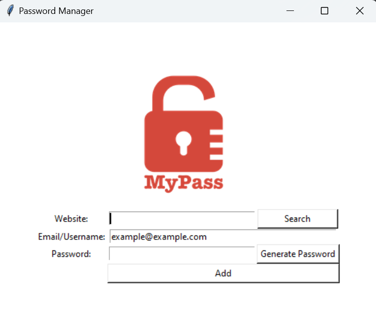

# 🔐 Password Manager

A simple yet functional password manager built with Python and Tkinter.  
It allows users to:

- Generate strong random passwords
- Save website credentials (website, email, password) to a local file
- Copy generated passwords to clipboard
- Auto-fill default email/username

> Designed with minimalism in mind — perfect for quick offline usage.

---

## 🚀 Features

- Random password generator with mix of letters, numbers, and symbols
- User-friendly interface using Tkinter
- Local data storage in `password_data.json`
- Automatically copies generated password to clipboard
- Search saved credentials by website
- Detect and update existing website data
- Pre-fills commonly used email address
- Helpful error messages and confirmation prompts

---

## 📸 Screenshot



---

## 🛠️ How to Run

1. Make sure Python is installed.
2. Install required packages:
   ```bash
   pip install pyperclip
   ```
3. Run the app:
   ```bash
   python main.py
   ```
   This will launch the password manager GUI.

